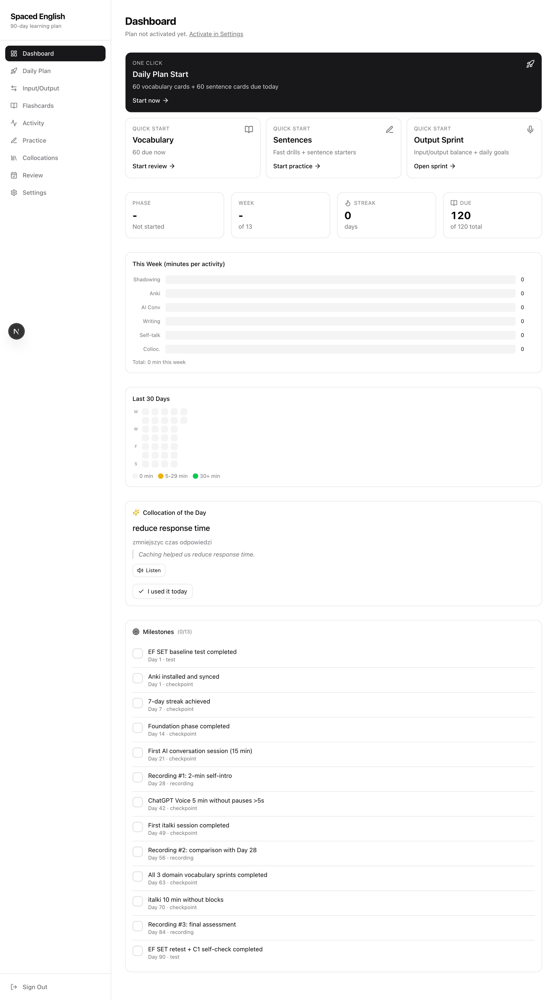
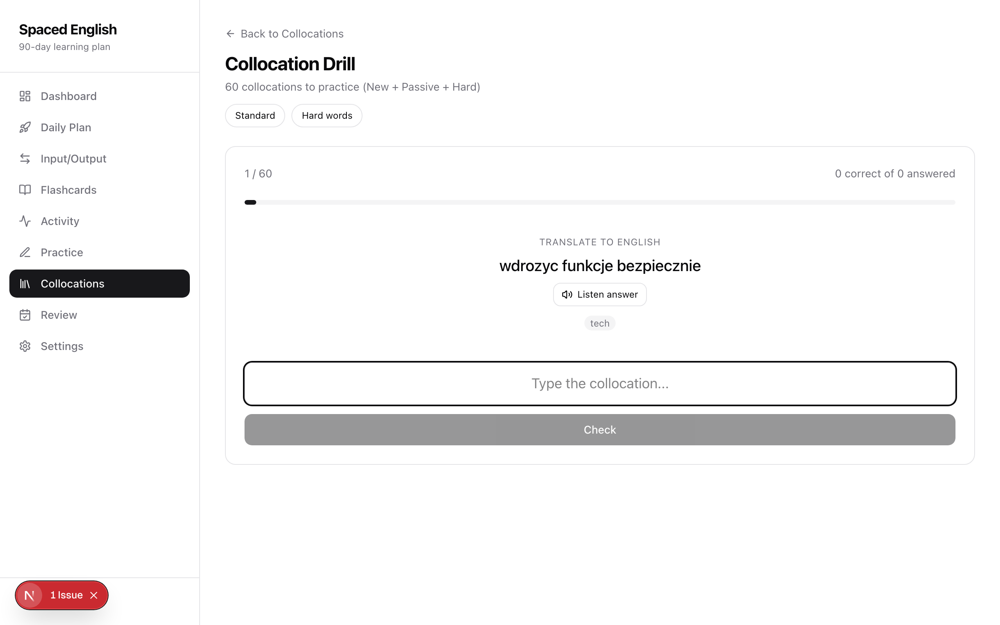
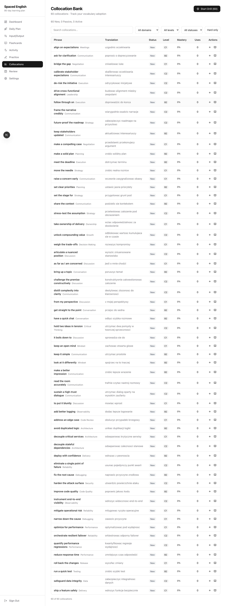
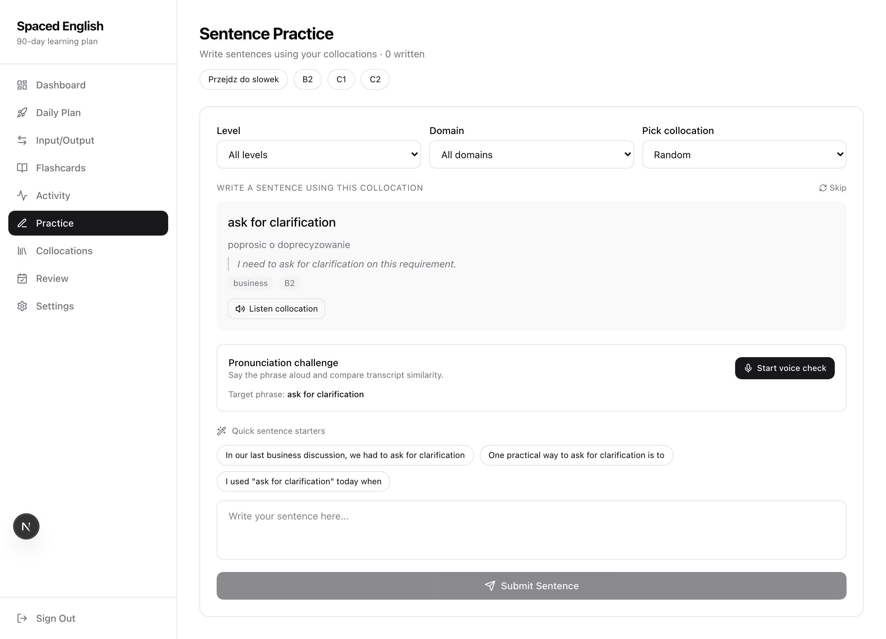

# Spaced English

**Self-hosted English learning platform with spaced repetition (SM-2).** Master B2-C2 collocations through flashcards, typing drills, and daily practice sessions.

[](https://nextjs.org/)
[](https://www.typescriptlang.org/)
[](https://www.postgresql.org/)
[](LICENSE)
[](CONTRIBUTING.md)

---

## Screenshots

| Dashboard | Typing Drill |
|:---------:|:------------:|
|  |  |

| Collocation Bank | Practice |
|:----------------:|:--------:|
|  |  |

## Features

- **SM-2 Spaced Repetition** — scientifically proven algorithm schedules reviews at optimal intervals
- **60 Collocations** — curated B2/C1/C2 phrases across business, tech, and social domains
- **Typing Drills** — translate collocations from your native language to English under time pressure
- **Flashcard Reviews** — vocabulary and sentence cards with 4-level quality rating (Again/Hard/Good/Easy)
- **90-Day Learning Plan** — structured 3-phase program with weekly milestones
- **Activity Tracking** — log shadowing, writing, AI conversations, and more
- **Streak Calendar** — visualize your consistency over the last 30 days
- **Daily Collocation** — featured phrase on dashboard to start each day
- **Input/Output Balance** — track your ratio of receptive vs productive practice
- **Weekly Reviews** — reflect on progress and adjust your approach
- **PWA Support** — install on mobile, works offline-capable
- **Security Hardened** — bcrypt passwords, JWT sessions, rate limiting, honeypot protection

## AI Features (Optional)

Set `ANTHROPIC_API_KEY` in `.env` to enable 4 AI-powered features built with the Claude API:

| Feature | API Pattern | Model | Description |
|---------|-------------|-------|-------------|
| **AI Sentence Coach** | `tool_use` (forced) | Sonnet | Evaluates practice sentences with structured feedback: naturalness score (1-5), corrections, explanations, alternatives |
| **AI Drill Companion** | Cached generation | Haiku | Context-aware tips after each drill attempt. Cached per phrase — max 120 API calls ever, then $0 |
| **Smart Review Agent** | Agentic tool loop | Sonnet | Autonomously calls 4 data tools to analyze your learning patterns, then produces weekly focus recommendations |
| **MCP Server** | Model Context Protocol | — | Exposes learning data via MCP so Claude Code can query your progress. See [`mcp-server/README.md`](mcp-server/README.md) |

All features are **opt-in** — the app works fully without an API key. Rate limited to 20 AI calls/day per user.

## Quick Start

### Prerequisites

- [Node.js 22+](https://nodejs.org/) and [pnpm](https://pnpm.io/)
- [Docker](https://www.docker.com/) (for local PostgreSQL) or an existing PostgreSQL 15+ instance

### One-command setup

```bash
git clone https://github.com/V3D1/spaced-english.git
cd spaced-english
pnpm setup
```

This runs `scripts/setup.sh` which:
1. Copies `.env.example` to `.env` and generates `AUTH_SECRET`
2. Starts PostgreSQL via Docker Compose
3. Installs dependencies
4. Runs database migrations
5. Seeds the database with collocations and a default user account

Then start the dev server:

```bash
pnpm dev
```

Open [http://localhost:3000](http://localhost:3000) and sign in with the email/password from your `.env` file.

### Manual setup

If you prefer not to use the setup script:

```bash
cp .env.example .env
# Edit .env: set POSTGRES_URL, AUTH_SECRET, SEED_USER_EMAIL, SEED_USER_PASSWORD

docker compose up -d        # or use your own PostgreSQL
pnpm install
pnpm db:migrate
pnpm db:seed
pnpm dev
```

## Architecture

```
Browser  →  Next.js 16 (App Router + Server Actions)  →  Drizzle ORM  →  PostgreSQL
                    ↓
             SM-2 Algorithm (lib/srs/sm2.ts)
```

**SM-2 Algorithm:** Each flashcard tracks `repetitions`, `interval`, and `easeFactor`. On each review, the algorithm calculates when you should see the card next. Cards rated "Again" (0) or "Hard" (2) reset to short intervals. Cards rated "Good" (3) or "Easy" (5) grow their interval exponentially.

## Tech Stack

| Layer | Technology |
|-------|-----------|
| Framework | Next.js 16 (App Router, Turbopack) |
| Language | TypeScript 5.8 |
| Database | PostgreSQL 17 |
| ORM | Drizzle ORM |
| Styling | Tailwind CSS 4 |
| UI Components | Radix UI + shadcn/ui |
| Auth | JWT (jose) + bcrypt |
| Validation | Zod |
| AI | Claude API (Anthropic SDK) |
| Testing | Vitest |

## Configuration

| Variable | Required | Default | Description |
|----------|----------|---------|-------------|
| `POSTGRES_URL` | Yes | — | PostgreSQL connection string |
| `AUTH_SECRET` | Yes | — | JWT signing key (min 32 chars) |
| `SEED_USER_EMAIL` | For seed | — | Email for the initial user account |
| `SEED_USER_PASSWORD` | For seed | — | Password for the initial user (min 12 chars) |
| `SESSION_TTL_DAYS` | No | `90` | Session cookie lifetime in days |
| `LOGIN_RATE_WINDOW_MINUTES` | No | `15` | Rate limiting window |
| `LOGIN_RATE_MAX_ATTEMPTS` | No | `5` | Max login attempts per window |
| `LOGIN_LOCKOUT_LEVELS_MINUTES` | No | `15,60,1440` | Progressive lockout durations |
| `ANTHROPIC_API_KEY` | No | — | Enables AI Coach features (sentence eval, drill tips, smart review) |

## Adding Custom Content

All learning content lives in `lib/learning/content.ts`. Each collocation has:

```typescript
{
  phrase: 'move the needle',           // English collocation
  translation: 'make a real difference', // Translation / definition
  example: 'This can move the needle on retention.',
  domain: 'business',                  // business | tech | social
  category: 'Strategy',
  level: 'C1',                         // B2 | C1 | C2
}
```

After editing, run `pnpm db:seed` to reload the database.

## Scripts

| Command | Description |
|---------|-------------|
| `pnpm dev` | Start dev server (Turbopack) |
| `pnpm build` | Production build |
| `pnpm test` | Run tests |
| `pnpm db:migrate` | Apply database migrations |
| `pnpm db:seed` | Seed collocations and user |
| `pnpm db:studio` | Open Drizzle Studio (DB browser) |
| `pnpm progress:reset` | Reset all learning progress |
| `pnpm setup` | Full one-command setup |
| `pnpm mcp:start` | Start MCP server (stdio) |

## Contributing

See [CONTRIBUTING.md](CONTRIBUTING.md) for how to set up locally, code style guidelines, and the PR process.

## Security

See [SECURITY.md](SECURITY.md) for responsible disclosure guidelines.

## License

[MIT](LICENSE) — Maciej Kick
